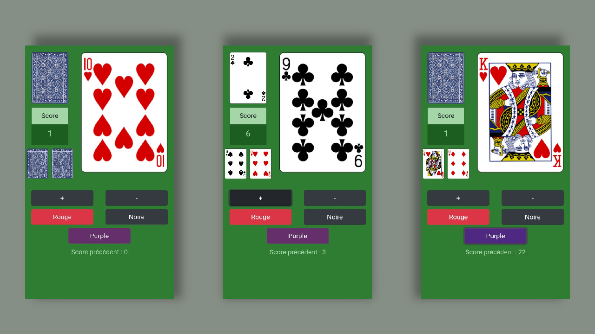

# Purple
Application mobile du jeu de cartes "la violette"

## Installation
[Apache Cordova](https://cordova.apache.org/)

`git clone https://github.com/gdescomps/purple.git`

## Compilation et lancement pour Android
`cordova platform add android`  
`cordova build android`  
`cordova run android`  

## Ressources
* [Deck Of Cards API](https://deckofcardsapi.com/) ([source](https://github.com/crobertsbmw/deckofcards))
* [Bootstrap](https://getbootstrap.com/) ([source](https://github.com/twbs/bootstrap))

